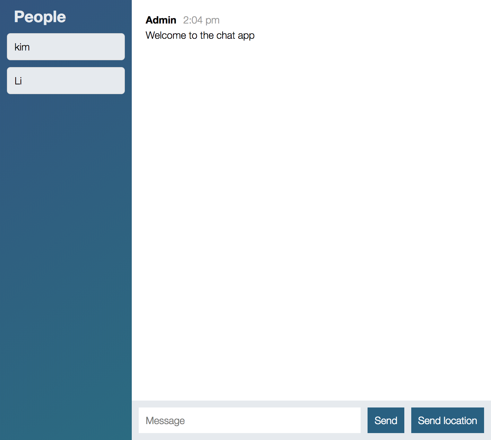

# Realtime-chat-application

[Demo at https://fathomless-coast-29088.herokuapp.com/](https://fathomless-coast-29088.herokuapp.com/)

[](https://travis-ci.org/feathersjs/feathers-chat)
[](https://david-dm.org/feathersjs/feathers-chat)

> A simple real-time chat application written in Nodejs

> **Important:** This repository requires Node v8.0.0 or later.

## Screenshot



## About

This project uses [SocketIO](https://socket.io/). An open source web framework for building modern real-time applications and a frontend in plain JavaScript and jQuery.

Other chat frontends can be found at:

## Getting Started

Getting up and running is as easy as 1, 2, 3.

1. Make sure you have [NodeJS](https://nodejs.org/) and [npm](https://www.npmjs.com/) installed.
2. Install your dependencies

   ```
   cd path/to/chat-app
   npm install
   ```

3. Start your app

   ```
   npm start
   ```

4. Goto to browser and go to [localhost:3000](http://localhost:3000)

## Testing

Simply run `npm test` and all your tests in the `test/` directory will be run.

## Help

For more information on all the things you can do, send me a message at [Kim Tran](http://kimhieutran.com)

## License

Copyright (c) 2017

Licensed under the [MIT license](LICENSE).
